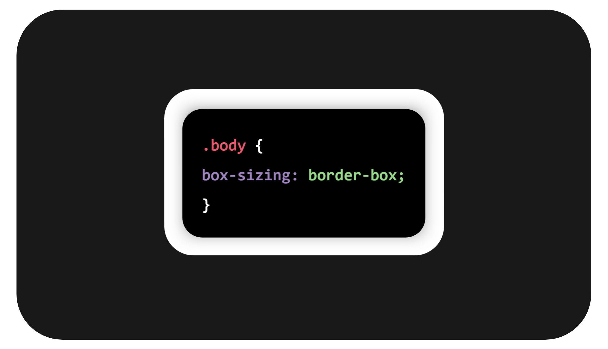
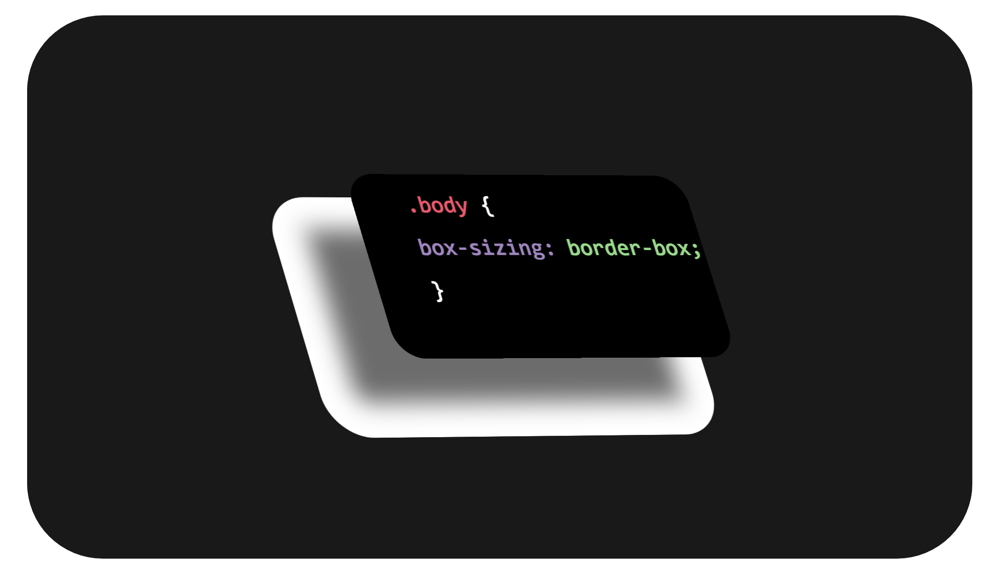

## Commands to get the Site running

Install dependencies

    npm i

Watch Sass files and compile to CSS

    npm run sass-dev

Compile Sass files to minified CSS (for production)

    npm run sass-prod

Start browsersync server

    npm run sync

  
 
### Screenshots

